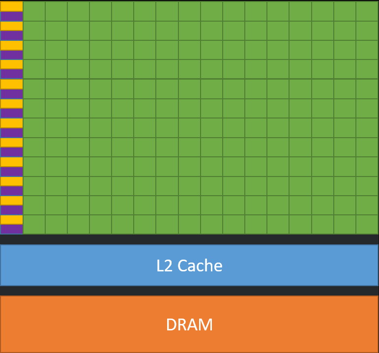

# Vector-Search
Vector search is a powerful technique to identify similar elements. This is a simple gpu parallel processing implementation to find the closest vector based on the minimum `Euclidean Distance`.

## GPU Parallel Processing
The architecure of a GPU includes a large amount of processing cores, the picture below from Nvidia's documentation illustrates this.


Green: Processing cores
Purple: L1 cache
Yellow: Control units

The vast amount of processing cores make GPUs useful for Single Instruction, Multiple Data operations.

For quickly iterating through a large matrix and finding `Euclidean Distance` we can build a block that contains number of threads equivalent to the number of columns and then use many blocks when we launch our kernel.

[Parallel Traversal vs Regular Traversal](./images/matrixTraversal.png)

The picture above illustrates a simple examples of iterating through a matrix with GPU parallel processing vs a regular loop.
 
## Performance
CPU Results:
```
CPU
ROWS: 33554432
COLUMNS: 50
NEAREST VECTOR INDEX: 5021
TIME TAKEN: 59.019957
```
GPU Results:
```
GPU
ROWS: 33554432
COLUMNS: 50
NEAREST VECTOR INDEX: 5021
TIME TAKEN: 1.681548
```

We see about a 35 times faster result from our GPU program.


